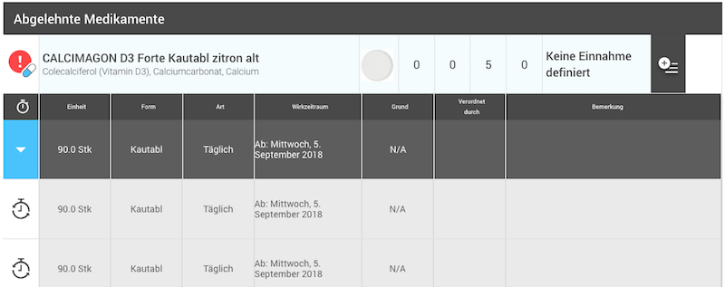
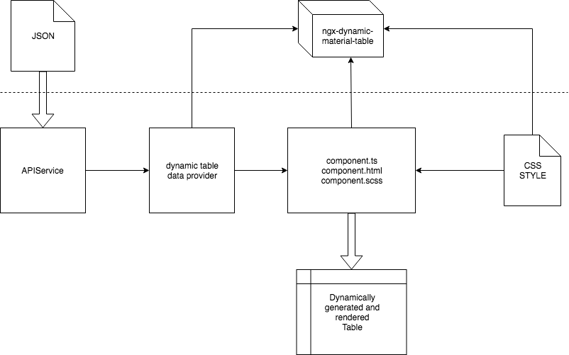
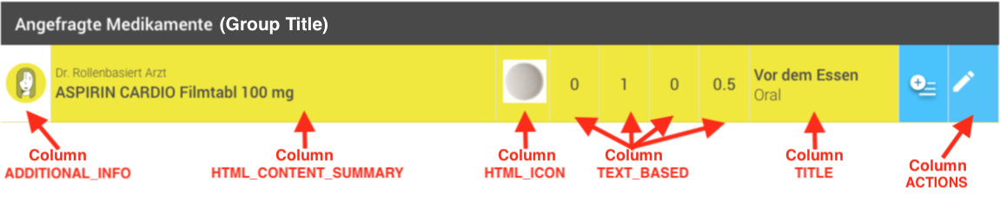

# ngx-dynamic-material-table
> Create fancy and complex tables 
dynamically and very rapidly.



## Table of Contents
[1. Demo](#Demo)  
[2. What is it?](#What)  
[3. Features](#Features)  
[4. Installation](#Installation)  
[5. Setup](#Setup)  
[6. Tutorials](#Tutorials)  
[7. Development](#Development)

<a name="Demo"></a>
## Online Demo 
> :white_check_mark: https://g-sari.github.io/ngx-dynamic-table/

<a name="What"></a>
## What is it?

* **Why:** The table is a core element, and used almost on every page to display a list of data, which means without having a library or widget, you will have multiple tables and duplicate implementations. Actually the table functionalities are always the same, it defers only in design and content.
* **Problem:** If you have ever used the angular material table, you already faced to the problem, that only strings can be displayed dynamically inside of a cell. Of course you can add a component inside of your template, but this component will be displayed for each row, which means you will always see the same component in the cell for each data row. In other words it's not possible to display different components for each data row in a cell. 
* **Solution:** With the dynamic material table, it's now very easy to create complex dynamic tables.



<a name="Features"></a>
## Features

* Add dynamically rendered components/html to the cells for each data row.
* Expandable rows up to 3 levels.
* Define column names and customized column ids.
* Pass data as an array into the table.
* 8 predefined common cells/columns, which can be overriden.
* Automatically group data by the given groups.
* Possibility to define table options for each defined group.
* Events based communication with the host component.
* Customize table style by overriding predefined/generated css classes.

<a name="Installation"></a>
## Installation
```javascript
npm install ngx-dynamic-material-table --save
```

<a name="Setup"></a>
## Setup

Import **DynamicTableModule** and **forRoot()** to your module as shown below, where you want to use the table.

```typescript
import { NgModule } from '@angular/core';
import { DynamicTableModule, DynamicTableDataProvider } from 'ngx-dynamic-material-table';

@NgModule({
    imports: [
        DynamicTableModule,
        DynamicTableModule.forRoot()
    ],
    declarations: [],
})
export class YourModule { }
```

## Tutorials

Follow the tutorials below to learn how to use the dynamic table in your project.

>Dynamic table
<br/>(simple basic table example)

In our example we are going to create a table, where we can display a list of persons, with some actions, icons and some additional data, see the picture below:


1. Create a new angular component i.e. **PersonsListComponent** or if you already have created a component, go to your component folder. Example component code:

```typescript
@Component({
    selector: 'persons-list-component',
    templateUrl: './persons-list.component.html',
    styleUrls: ['./persons-list.component.scss']
})
export class PersonsListComponent {
    // your component's logic
}
```

2. Create inside the folder a new injectable angular service i.e in our example we're going to name it **persons-list-data-provider.ts**.
3. Extend your created data provider service by the class **AbstractDynamicTableDataProvider< T >**.
4. Change the generic < T > to your data type, you're using in your data array i.e. < PersonModel > or a general < Object >.
5. Implement all inherited abstract functions from AbstractDynamicTableDataProvider i.e. see the code below for an example and descriptions:
* At the end our example persons list data provider should look like in the code below:

```typescript
import { Injectable } from '@angular/core';
import { Observable } from 'rxjs';
import {
    DynamicTableOptionInterface,
    DynamicTableColumnDefinitionConstants,
    DynamicTableColumnInterace,
    AbstractDynamicTableDataProvider,
    DynamicTableUIUtils
} from 'ngx-dynamic-material-table';

@Injectable()
export class PersonsListDataProvider extends AbstractDynamicTableDataProvider<Object> {

    public static readonly ACTION_SELECT_PATIENT = 'selectPatient';
    public static readonly ACTION_DEACTIVATE_PATIENT = 'deactivatePatient';
    public static readonly ACTION_SHOW_PATIENT_COLORS = 'showPatientColors';

    constructor(private colorsHelperService: ColorsHelperService, private personAPIService: PersonAPIService) { super(); }

     // Defines and gets the columns displayed in the persons list table.
    getColumns(): DynamicTableColumnInterace[] {
        const columns = [
            { columns: [DynamicTableColumnDefinitionConstants.HTML_ICON], names: ['Icon'], backgroundColor: null },
            { columns: [DynamicTableColumnDefinitionConstants.TITLE], names: ['Person name'], backgroundColor: null },
            { columns: [DynamicTableColumnDefinitionConstants.HTML_CONTENT_SUMMARY], names: ['Colors'], backgroundColor: null },
            { columns: [DynamicTableColumnDefinitionConstants.HTML_ACTIONS], names: ['Actions'], backgroundColor: null }
        ];
        return columns;
    }

    // Retrieves the persons data displayed as row items inside of the table.
    getData(sort: string, order: string, page: number): Observable<Object[]> {
        return this.personAPIService.loadPatients();
    }

    // Retrieves the icon displayed for each person item.
    getHTMLIcon(item: Object, rowIndex: number, groupIndex: number, groupName: string): string {
        return '<mat-icon class="icon-large icon-color-grey">person<mat-icon>';
    }

    // Retrieves the first and lastname for each person item.
    getTitle(item: Object, rowIndex: number, groupIndex: number, groupName: string): string {
        return item['lastName'] + ' ' + item['firstName'];
    }

    // Retrieves assigned person colors as material fab buttons.
    getHTMLContentSummary(item: Object, rowIndex: number, groupIndex: number, groupName: string): string {
        const stringBuffer = new StringBuffer();
        const flags = item['flags'];
        const splittedFlags = (flags != null && flags !== '') ? flags.split(',') : [];
        for (const flagId of splittedFlags) {
            const colorId = parseInt(flagId, 10);
            const mappedColor: Color = this.colorsHelperService.getColor(colorId);
            const orgColor: OrgColor = this.colorsHelperService.getOrgColorById(colorId);
            const colorDescription = (orgColor !== null) ? orgColor['colorDesc'] : 'N/A';
            stringBuffer.append(
                '<button mat-mini-fab matTooltip="' + colorDescription + '" style="background-color:#' + mappedColor.value + ';"></button> '
            );
        }
        return stringBuffer.toString();
    }

    // Retrieves the actions for each person item in the table.
    getHTMLAction(item: Object, rowIndex: number, groupIndex: number, groupName: string): string {
        const stringBuffer = new StringBuffer();
        // First action: Go to person details
        stringBuffer.append('<button mat-raised-button color="accent" ');
        stringBuffer.append('(click)="' + DynamicTableUIUtils.createHTMLAction(PersonsListDataProvider.ACTION_SELECT_PATIENT, item) + '">');
        stringBuffer.append('<mat-icon class="icon-medium">play_arrow</mat-icon>');
        stringBuffer.append('</button>');
        stringBuffer.append(' ');
        // Second action: Open colors dialog/modal
        stringBuffer.append('<button mat-raised-button color="primary" ');
        stringBuffer.append('(click)="' + DynamicTableUIUtils.createHTMLAction(PersonsListDataProvider.ACTION_SHOW_PATIENT_COLORS, item) + '">');
        stringBuffer.append('<mat-icon class="icon-medium">palette</mat-icon>');
        stringBuffer.append('</button>');
        stringBuffer.append(' ');
        // Third action: Deactivate/delete person
        stringBuffer.append('<button mat-raised-button color="warn" ');
        stringBuffer.append('(click)="' + DynamicTableUIUtils.createHTMLAction(PersonsListDataProvider.ACTION_DEACTIVATE_PATIENT, item) + '">');
        stringBuffer.append('<mat-icon class="icon-medium">do_not_disturb</mat-icon>');
        stringBuffer.append('</button>');
        return stringBuffer.toString();
    }

    /////////////////////// Undefined columns/cells ///////////////////////

    // Predefined column IndicatorColor: Retrieves the color for each data row/item, where i.e. an enumeration can be displayed like 1. row, 2. row, 3. row etc.
    getIndicatorColor(item: Object, rowIndex: number, groupIndex: number, groupName: string): string {
        return null;
    }

    // Predefined column IndicatorSign: Retrieves the sign for each data row/item, where i.e. an enumeration can be displayed. This sign could be i.e. a number or a letter.
    getIndicatorSign(item: Object, rowIndex: number, groupIndex: number, groupName: string): string {
        return null;
    }

    // Predefined column AdditionalInfo: Retrieves the additional info for each data row/item.
    getAdditionalInfo(item: Object, rowIndex: number, groupIndex: number, groupName: string): string {
        return null;
    }

    // Predefined column Description: Retrieves the description for each data row/item.
    getDescription(item: Object, rowIndex: number, groupIndex: number, groupName: string): string {
        return null;
    }

    // Predefined column OtherTextBased: Retrieves an other text based cell for each data row/item.
    getOtherTextBased(item: Object, rowIndex: number, groupIndex: number, groupName: string): string {
        return null;
    }

    // Retrieves table options incl. grouping of data. Return null, if you don't want to group data.
    getOptions(): DynamicTableOptionInterface[] {
        return null;
    }
}
```

* As you can see each predefined column can be overriden and the UI logic can be defined inside of the predefined columns.
* Our persons list is almost done, we now need to provide our PersonsListDataProvider as a data provider for our table.
6. Go to your module where your component is declared, and define the PersonsListDataProvider like in the code below, see especially the providers[] section:

```typescript
import { NgModule } from '@angular/core';
import { DynamicTableModule, DynamicTableDataProvider } from 'ngx-dynamic-material-table';

@NgModule({
    imports: [
        DynamicTableModule,
        DynamicTableModule.forRoot()
    ],
    declarations: [
        PersonsListComponent
    ],
    providers: [
        PersonsListDataProvider,
        { provide: DynamicTableDataProvider, useExisting: PersonsListDataProvider },
    ],
})
export class YourModule { }
```

7. Finally add to your component html template in our case **persons-list.component.html** the following code snippet:

```html
<dynamic-table></dynamic-table>
```

* So we are done, our table is now ready to be displayed using our defined data provider.
8. Handle actions: What should happen, when we click on an action inside of a row. Handling of actions belongs to the list component and not to the data provider, hence implement in your component i.e. in our example  **PatientsListComponent** the generic interface **UsingDynamicTableComponent< T >** like in the code below:

```typescript
import { Component, AfterViewInit } from '@angular/core';
import { PatientListDataProvider } from './patient-list-data-provider';
import { UsingDynamicTableComponent, DynamicTableActionMessageService } from 'ngx-dynamic-material-table';

@Component({
    selector: 'persons-list-component',
    templateUrl: './persons-list.component.html',
    styleUrls: ['./persons-list.component.scss']
})
export class PersonsListComponent implements AfterViewInit, UsingDynamicTableComponent<Object> { 

    constructor(
        private dynamicTableActionMessageService: DynamicTableActionMessageService<object>,
        private patientListDataProvider: PatientListDataProvider,
    ) {}

    ngAfterViewInit() {
        this.handleDynamicTableActions(this.dynamicTableActionMessageService.getPubisher());
    }

    // Handles actions published by the dynamic table
    handleDynamicTableActions(publisher: Observable<object>): void {
        publisher.subscribe(
            (actionMessage: DynamicTableActionMessageService<object>) => {
                switch (actionMessage.getAction()) {
                    case PatientListDataProvider.ACTION_SELECT_PATIENT:
                        this.selectPerson(actionMessage.getItem());
                        break;
                    case PatientListDataProvider.ACTION_DEACTIVATE_PATIENT:
                        this.deactivatePerson(actionMessage.getItem());
                        break;
                    case PatientListDataProvider.ACTION_SHOW_PATIENT_COLORS:
                        this.openPersonColorsDialog(actionMessage.getItem());
                        break;
                }
            }
        );
    }

}
```

>Dynamic expandable table
<br/>(extended complex table example)

In this example we are going to create a complex table, where we can display a list of prescribed drugs, with a lot of columns, several groups, up to 3 levels expandable rows, several actions, different colors for several rows and cells, a customized style and several group options, see the picture below:


1. Create a new angular component i.e. **DrugsListComponent** or if you already have created a component, go to your component folder. Example component code:

```typescript
@Component({
    selector: 'drugs-list-component',
    templateUrl: './drugs-list.component.html',
    styleUrls: ['./drugs-list.component.scss']
})
export class DrugsListComponent {
    // your component's logic
}
```

2. Create inside the folder a new injectable angular service i.e in our example we're going to name it **drugs-expandable-table-data-provider.ts**.
3. Extend your created data provider service by the class **AbstractDynamicExpandableTableDataProvider< T >**.
4. Change the generic < T > to your data type, you're using in your data array i.e. < DrugModel > or a general < Object >.
5. Implement all inherited abstract functions from AbstractDynamicExpandableTableDataProvider i.e. see the code below for descriptions and explanations:
* At the end our example drugs expandable table data provider should look like in the code below:

```typescript
import { Injectable } from '@angular/core';
import { Observable, of } from 'rxjs';
import {
    AbstractDynamicExpandableTableDataProvider,
    DynamicExpandableTableColumnDefinitionConstants,
    DynamicExpandableTableExpandedItemColumnInterace,
    DynamicTableColumnInterace,
    DynamicExpandableTableOptionInterface,
    DynamicTableGroupInterface,
    DynamicTableUIUtils
} from 'ngx-dynamic-material-table';

@Injectable()
export class DrugsExpandableTableDataProvider extends AbstractDynamicExpandableTableDataProvider<Object> {

    public static readonly MOUSE_OVER_EVENT_SHOW_DRUG_PACKAGE = 'showDrugPackageOnMouseOver';
    public static readonly MOUSE_OUT_EVENT_HIDE_DRUG_PACKAGE = 'hideDrugPackageOnMouseOut';
    public static readonly ACTION_EDIT_DRUG = 'editSelectedDrug';
    private static readonly GROUP_NAME_1 = 'Requested drugs';
    private static readonly GROUP_NAME_2 = 'Active drugs';
    private static readonly GROUP_NAME_3 = 'Reserved drugs';
    private static readonly GROUP_NAME_4 = 'Rejected drugs';
    private static readonly GROUP_NAME_5 = 'Expired drugs';
    private expandedItemTableData: Object[] = this.createExpandedItemData(); // 1. level expanded row data
    
    constructor(private drugsService: DrugsService, private userService: UserService) { super(); }

    // Defines and gets the columns displayed in the drugs list table.
    getColumns(): DynamicTableColumnInterace[] {
        return [
            this.iconColumnDefinition,
            { columns: [DynamicExpandableTableColumnDefinitionConstants.DESCRIPTION], names: ['ATC Code'], backgroundColor: null },
            { columns: [DynamicExpandableTableColumnDefinitionConstants.HTML_CONTENT_SUMMARY], names: ['Drug Name'], backgroundColor: null },
            { columns: [DynamicExpandableTableColumnDefinitionConstants.HTML_ICON], names: ['Drug Icon'], backgroundColor: null },
            {
                columns:
                    [
                        DynamicExpandableTableColumnDefinitionConstants.OTHER_TEXT_BASED1,
                        DynamicExpandableTableColumnDefinitionConstants.OTHER_TEXT_BASED2,
                        DynamicExpandableTableColumnDefinitionConstants.OTHER_TEXT_BASED3,
                        DynamicExpandableTableColumnDefinitionConstants.OTHER_TEXT_BASED4,
                    ],
                names: ['Morning', 'Noon', 'Evening', 'Night'], backgroundColor: null
            },
            { columns: [DynamicExpandableTableColumnDefinitionConstants.TITLE], names: ['Drug Administration'], backgroundColor: null },
            this.expandableColumn,
            { columns: [DynamicExpandableTableColumnDefinitionConstants.HTML_ACTIONS], names: ['Actions'], backgroundColor: '#4AC3FC' }
        ];
    }

    // Retrieves the drugs data displayed as row items inside of the table.
    getData(sort: string, order: string, page: number): Observable<object[]> {
        return this.drugsService.loadDrugs('de');
    }

    // Retrieves an individual icon for each groups icon cell
    getAdditionalInfo(item: object, rowIndex: number, groupIndex: number, groupName: string): string {
        const stringBuffer = new StringBuffer();
        if (groupName === EMedisExpandableTableDataProvider.GROUP_NAME_1 && groupIndex === 0) {
            stringBuffer.append('<mat-icon class="icon-large" svgIcon="' + User.getIcon(7) + '"></mat-icon>');
        } else if (groupName === EMedisExpandableTableDataProvider.GROUP_NAME_2 && groupIndex === 1) {
            stringBuffer.append('<mat-icon class="icon-large" svgIcon="cdss-ok"></mat-icon>');
        } else if (groupName === EMedisExpandableTableDataProvider.GROUP_NAME_3 && groupIndex === 2) {
            stringBuffer.append('<mat-icon class="icon-large" svgIcon="cdss-warning"></mat-icon>');
        } else if (groupName === EMedisExpandableTableDataProvider.GROUP_NAME_4 && groupIndex === 3) {
            stringBuffer.append('<mat-icon class="icon-large" svgIcon="cdss-danger"></mat-icon>');
        }
        return stringBuffer.toString();
    }

    // Retrieves the drug's pill image and a functionality to show the drug package inside a modal window on mouse over
    getHTMLIcon(item: object, rowIndex: number, groupIndex: number, groupName: string): string {
        const stringBuffer = new StringBuffer();
        stringBuffer.append('');
        return stringBuffer.toString();
    }

    // Retrieves the intake direction (after the meal) and drugs administrator route (per oral) information
    getTitle(item: object, rowIndex: number, groupIndex: number, groupName: string): string {
        let title = '<div class="drug-when">' + this.eMedisTranslationsService.getWhenTranslatedText(item) + '</div>';
        title += '<div class="drug-administration">' + item['_medicationAdministrationDescription'] + '</div>';
        return title;
    }

    // Retrieves the substances of a drug (i.e. paracetamol)
    getDescription(item: object, rowIndex: number, groupIndex: number, groupName: string): string {
        return '<div class="medinfo-atc">' + DrugsUtils.getAtcDescriptionByCode(this.atcCodes, item['medinfo']['_atc']) + '</div>';
    }

    // Retrieves the substances of a drug (i.e. paracetamol) 
    getHTMLContentSummary(item: object, rowIndex: number, groupIndex: number, groupName: string): string {
        let description = '<div class="drug-name">' + item['medinfo']['dscr'] + '</div>';
        const substances = item['medinfo']['subst'];
        if (substances != null && substances.length > 0) {
            description += '<div class="active-ingredient">' + EMedisUtils.convertSubstancesToString(substances) + '</div>';
        }
        return description;
    }

    // Retrieves additional text based columns
    getOtherTextBased(item: object, columnIndex: number, groupIndex: number, groupName: string): string {
        const unit = item['medinfo']['_qtyu'];
        if (columnIndex === 1) {
            return item['_morning'];
        } else if (columnIndex === 2) {
            return item['_noon'];
        } else if (columnIndex === 3) {
            return item['_evening'];
        } else if (columnIndex === 4) {
            return item['_night'];
        }
        return '';
    }

    // Retrieves the actions for each drug itemn and group. (i.e. for the first group we return a slide toggle button)
    getHTMLAction(item: object, rowIndex: number, groupIndex: number, groupName: string): string {
        const stringBuffer = new StringBuffer();
        if (groupName === DrugsListDataProvider.GROUP_NAME_1 && groupIndex === 0) {
            stringBuffer.append('<mat-slide-toggle color="accent" class="requested-drugs-slide-toggle"></mat-slide-toggle>');
        } else {
            stringBuffer.append('<mat-icon class="icon-medium icon-color-white edit-drug"');
            stringBuffer.append('(click)="' + DynamicTableUIUtils.createHTMLAction(EMedisExpandableTableDataProvider.ACTION_EDIT_DRUG, item) + '">');
            stringBuffer.append('edit');
            stringBuffer.append('</mat-icon>');
        }
        return stringBuffer.toString();
    }

    // Defines and retrieves options for several table groups 
    getOptions(): DynamicExpandableTableOptionInterface[] {
        const options: DynamicExpandableTableOptionInterface[] = [];
        // General column options
        const expandableColumnOption = Object.assign({}, this.expandableColumn);
        expandableColumnOption['hoverBackgroundColor'] = '#494949'; // Change hover background color
        const actionsColumnOption = { columns: [DynamicExpandableTableColumnDefinitionConstants.HTML_ACTIONS], names: ['Actions'], backgroundColor: '#4AC3FC' };
        actionsColumnOption['backgroundColor'] = '#FFFFFF'; // Change background color of the actions column
        // 1. table group options: Requested drugs
        const groupByRequested: DynamicTableGroupInterface = this.createGroupExpression('approval', [{ 'operator': '==', 'value': DrugApprovalConstants.PENDING }]);
        options.push(this.createExpandableTableOption(DrugsExpandableTableDataProvider.GROUP_NAME_1, [{ group: groupByRequested, operator: '' }], [expandableColumnOption, actionsColumnOption], '#F2E70A'));
        // 2. table group options: Active drugs
        const table2IconColumnOption = Object.assign({}, this.iconColumnDefinition);
        table2IconColumnOption['backgroundColor'] = '#4AC3FC';
        const groupByApproved: DynamicTableGroupInterface = this.createGroupExpression('approval', [{ 'operator': '==', 'value': DrugApprovalConstants.APPROVED }]);
        const groupByWithoutReserved: DynamicTableGroupInterface = this.createGroupExpression('_usage', [{ 'operator': '!=', 'value': DrugUsageConstants.RESERVED }], 'Number');
        const groupByDate: DynamicTableGroupInterface = this.createGroupExpression('date-to', [{ 'operator': '==', 'value': 'null' }, { 'operator': '||', 'value': '' }, { 'operator': '!=', 'value': null }], 'Date');
        options.push(this.createExpandableTableOption(DrugsExpandableTableDataProvider.GROUP_NAME_2, [{ group: groupByApproved, operator: '&&' }, { group: groupByWithoutReserved, operator: '&&' }, { group: groupByDate, operator: '' }], [expandableColumnOption, table2IconColumnOption]));
        // 3. table group options: Reserved drugs
        const table3IconColumnOption = Object.assign({}, this.iconColumnDefinition);
        table3IconColumnOption['backgroundColor'] = '#4AC3FC';
        const groupByReserved: DynamicTableGroupInterface = this.createGroupExpression('_usage', [{ 'operator': '==', 'value': DrugUsageConstants.RESERVED }], 'Number');
        options.push(this.createExpandableTableOption(DrugsExpandableTableDataProvider.GROUP_NAME_3, [{ group: groupByReserved, operator: '' }], [expandableColumnOption, table3IconColumnOption]));
        // return table options
        return options;
    }

    // Retrieves the 1. level expanded row columns
    getExpandedItemTableColumns(expandedItem: object): DynamicExpandableTableExpandedItemColumnInterace[] {
        return [
            this.createExpandedItemColumn('expandedItemExpandableColumn', '', '#494949', '#ffffff', 'timer'),
            this.createExpandedItemColumn('unit', 'Einheit', '#494949', '#ffffff'),
            this.createExpandedItemColumn('unittype', 'Form', '#494949', '#ffffff'),
            this.createExpandedItemColumn('article', 'Art', '#494949', '#ffffff'),
            this.createExpandedItemColumn('dateRange', 'Wirkzeitraum', '#494949', '#ffffff'),
            this.createExpandedItemColumn('reason', 'Grund', '#494949', '#ffffff'),
            this.createExpandedItemColumn('physicianDrugAdministrator', 'Verordnet durch', '#494949', '#ffffff'),
            this.createExpandedItemColumn('comment', 'Bemerkung', '#494949', '#ffffff')
        ];
    }

    // Retrieves the data that should be displayed for the 1. expanded row
    getExpandedItemTableData(expandedItem: object): Observable<object[]> {
        const itemDetails: Object = this.expandedItemTableData[0];
        itemDetails['unit'] = expandedItem['medinfo']['_qty'] + ' ' + expandedItem['medinfo']['_qtyu'];
        itemDetails['unittype'] = expandedItem['medinfo']['_form'];
        itemDetails['article'] = this.eMedisTranslationsService.getUsageTranslatedText(expandedItem);
        itemDetails['dateRange'] = 'Von: ' + expandedItem['date-from'];
        if (expandedItem['date-to'] != null) {
            itemDetails['dateRange'] += '<br/>' + 'Bis: ' + expandedItem['date-to'];
        }
        itemDetails['reason'] = 'Infektion';
        itemDetails['physicianDrugAdministrator'] = expandedItem['physician-drug-administrator-name'];
        itemDetails['comment'] = expandedItem['comment'];
        return of(this.expandedItemTableData);
    }

    // Retrieves the 2. level expanded row columns
    getExpandedItemDetailsTableColumns(expandedItemDetails: object, expandedItem: object): DynamicExpandableTableExpandedItemColumnInterace[] {
        return [
            this.createExpandedItemColumn('icon', '', '#494949', '#ffffff', 'history-icon'),
            this.createExpandedItemColumn('unit', 'Einheit', '#494949', '#ffffff'),
            this.createExpandedItemColumn('unittype', 'Einheitstyp', '#494949', '#ffffff'),
            this.createExpandedItemColumn('article', 'Art', '#494949', '#ffffff'),
            this.createExpandedItemColumn('dateRange', 'Wirkzeitraum', '#494949', '#ffffff'),
            this.createExpandedItemColumn('reason', 'Indikation', '#494949', '#ffffff'),
            this.createExpandedItemColumn('physicianDrugAdministrator', 'Verordnet durch', '#494949', '#ffffff'),
            this.createExpandedItemColumn('comment', 'Bemerkung', '#494949', '#ffffff')
        ];
    }

    // Retrieves the data that should be displayed for the 2. expanded row
    getExpandedItemDetailsTableData(expandedItemDetails: object, expandedItem: object): Observable<object[]> {
        return this.loadDrugHistory(expandedItem['id']['elementId']);
    }

    // Loads the durgs history
    private loadDrugHistory(drugElementId: number): Observable<object[]> {
        return this.drugsService.loadDrugHistory(drugElementId, this.UserConfig.patientId, this.UserConfig.orgId)
            .pipe(
                map((drugElements: Object[]) => {
                    return this.drugsHistoryConverterPipe.transform(drugElements);
                })
            );
    }

    // Create an key value based object as an expanded item
    private createExpandedItemData(): Object[] {
        return [
            {
                'expandedItemExpandableColumn': '',
                'unit': '',
                'unittype': '',
                'article': '',
                'dateRange': '',
                'reason': '',
                'physicianDrugAdministrator': '',
                'comment': ''
            },
        ];
    }

    /////////////////////// Undefined columns/cells ///////////////////////
    getIndicatorColor(item: object): string {
        throw new Error("Method not implemented.");
    }

    getIndicatorSign(item: object): string {
        throw new Error("Method not implemented.");
    }

}
```

* All groups are created inside of the table options and the logic how to group the data is defined there as well. i.e. in the first group we want to group all approved drugs, so we defined the following group expression: Group by the property 'approval' and it's {'operator': '==', 'value': DrugApprovalConstants.PENDING }
* Notice that we defined different column background colors for expanded rows and additional in the table options individual cell background colors can also be defined.



* As you can see in the picture above the predefined column “ADDITIONAL_INFO” is used to show the user icon, “HTML_CONTENT_SUMMARY” is used to display the name of the drug etc...
6. Go to your module where your drugs list component is declared, and define the DrugsExpandableTableDataProvider like in the code below, see especially the providers[] section:

```typescript
import { NgModule } from '@angular/core';
import { DynamicExpandableTableDataProvider, DynamicExpandableTableDataProvider } from 'ngx-dynamic-material-table';

@NgModule({
    imports: [
        DynamicExpandableTableModule,
        DynamicExpandableTableModule.forRoot()
    ],
    declarations: [
        DrugsListComponent
    ],
    providers: [
        DrugsExpandableTableDataProvider,
        { provide: DynamicExpandableTableDataProvider, useExisting: DrugsExpandableTableDataProvider },
    ],
})
export class YourModule { }
```

7. Add to your component html template in our case **drugs-list.component.html** the following code snippet, notice that you can show or hide the filter:

```html
<dynamic-expandable-table [showFilter]="false"></dynamic-expandable-table>
```

8. Theming: see the following code example how to use a customized style for your table. For our tutorial example open your **drugs-list.component.scss** file and add:

```scss
@import '../../../../../node_modules/ngx-dynamic-material-table/theming';

///////////////////////////////////// VARIABLES /////////////////////////////////////
$row-height: 80px;

///////////////////////////////////// GENERAL STYLES /////////////////////////////////////
.flex-column {
    display: flex;
    flex-wrap: wrap;
    flex-direction: row;
    justify-content: flex-end;
    align-items: center;
    align-content: center;
    margin-left: 0px !important;
}

.text-color {
    color: #494949;
}

:host ::ng-deep .mat-toolbar {
    min-height: 50px;
    height: 50px;
}

:host ::ng-deep .mat-row {
    overflow: hidden;
}

:host ::ng-deep .mat-cell {
    @extend .text-color;
    border-right: 0.5px solid #e0e0e0;
}

:host ::ng-deep .mat-cell:first-child {
    padding-left: 0px !important;
}

///////////////////////////////////// OVERRIDE PREDEFINED COLUMNS /////////////////////////////////////
.drugs-column {
    justify-content: center;
}

:host ::ng-deep .color-column {
    @extend .drugs-column;
    width: 0%;
    min-width: 0%;
    max-width: 0%;
}

:host ::ng-deep .html-content-summary-column {
    @extend .drugs-column;
    justify-content: flex-start;
    padding-left: 5px;
    width: 30% !important;
    min-width: 30% !important;
    max-width: 30% !important;
}

:host ::ng-deep .description-column {
    @extend .drugs-column;
    justify-content: flex-start;
    padding-left: 5px;
    width: 15%;
    min-width: 15%;
    max-width: 15%;
}

:host ::ng-deep .title-column {
    @extend .drugs-column;
    justify-content: flex-start;
    padding-left: 5px;
    width: 15%;
    min-width: 15%;
    max-width: 15%;
}

:host ::ng-deep .icon-column {
    @extend .drugs-column;
    width: 5%;
    min-width: 5%;
    max-width: 5%;
}

:host ::ng-deep .additional-info-column {
    @extend .drugs-column;
    width: 5% !important;
    min-width: 5% !important;
    max-width: 5% !important;
}

:host ::ng-deep .other-text-based-column {
    @extend .drugs-column;
    width: 5%;
    min-width: 5%;
    max-width: 5%;
    font-size: 18px;
    font-weight: 400;
    line-height: 24px;
}

:host ::ng-deep .expandable-row-column {
    @extend .drugs-column;
    cursor: pointer;
    width: 5%;
    min-width: 5%;
    max-width: 5%;
}

:host ::ng-deep .actions-column {
    @extend .drugs-column;
    justify-content: flex-end;
    min-width: 5% !important;
}

///////////////////////////////////// (1. LEVEL) EXPANDED ITEM TABLE COLUMNS /////////////////////////////////////
:host ::ng-deep .pal-expandable-table-grouped-container {
    width: 85%
}

:host ::ng-deep .pal-expandable-table-grouped {
    margin-top: 25px;
}

.expanded-item-columns {
    @extend .flex-column;
    background-color: #5D5D5D;
    color: #ffffff;
    font-size: 14px;
    font-weight: 400;
    line-height: 16px;
}

:host ::ng-deep .expanded-item-column-expandedItemExpandableColumn {
    @extend .expanded-item-columns;
    justify-content: center;
    width: 5%;
    min-width: 5%;
    max-width: 5%;
    background-color: #40C4FF;
    cursor: pointer;
}

:host ::ng-deep .expanded-item-column-unit {
    @extend .expanded-item-columns;
    justify-content: center;
    width: 10%;
    min-width: 10%;
    max-width: 10%;
}

:host ::ng-deep .expanded-item-column-unittype {
    @extend .expanded-item-columns;
    justify-content: center;
    width: 10%;
    min-width: 10%;
    max-width: 10%;
}

:host ::ng-deep .expanded-item-column-article {
    @extend .expanded-item-columns;
    justify-content: center;
    width: 10%;
    min-width: 10%;
    max-width: 10%;
}

:host ::ng-deep .expanded-item-column-dateRange {
    @extend .expanded-item-columns;
    justify-content: center;
    width: 15%;
    min-width: 15%;
    max-width: 15%;
}

:host ::ng-deep .expanded-item-column-reason {
    @extend .expanded-item-columns;
    justify-content: center;
    width: 10%;
    min-width: 10%;
    max-width: 10%;
}

:host ::ng-deep .expanded-item-column-physicianDrugAdministrator {
    @extend .expanded-item-columns;
    justify-content: center;
    width: 10%;
    min-width: 10%;
    max-width: 10%;
}

:host ::ng-deep .expanded-item-column-comment {
    @extend .expanded-item-columns;
    justify-content: center;
    width: 30%;
    min-width: 30%;
    max-width: 30%;
}

///////////////////////////////////// (2. LEVEL) EXPANDED ITEM DETAIL TABLE COLUMNS /////////////////////////////////////
.expanded-item-detail-columns {
    @extend .expanded-item-columns;
    background-color: #EAEAEA;
    color: #5D5D5D;
}

:host ::ng-deep .expanded-item-detail-column-icon {
    @extend .expanded-item-column-expandedItemExpandableColumn;
    background-color: #FFFFFF;
    color: #000000;
    cursor: default;
}

:host ::ng-deep .expanded-item-detail-column-unit {
    @extend .expanded-item-detail-columns,
    .expanded-item-column-unit;
}

:host ::ng-deep .expanded-item-detail-column-unittype {
    @extend .expanded-item-detail-columns,
    .expanded-item-column-unittype;
}

:host ::ng-deep .expanded-item-detail-column-article {
    @extend .expanded-item-detail-columns,
    .expanded-item-column-article;
}

:host ::ng-deep .expanded-item-detail-column-dateRange {
    @extend .expanded-item-detail-columns,
    .expanded-item-column-dateRange;
}

:host ::ng-deep .expanded-item-detail-column-reason {
    @extend .expanded-item-detail-columns,
    .expanded-item-column-reason;
}

:host ::ng-deep .expanded-item-detail-column-physicianDrugAdministrator {
    @extend .expanded-item-detail-columns,
    .expanded-item-column-physicianDrugAdministrator;
}

:host ::ng-deep .expanded-item-detail-column-comment {
    @extend .expanded-item-detail-columns,
    .expanded-item-column-comment;
}

///////////////////////////////////// STYLE THE CONTENT INSIDE OF COLUMNS USED BY DrugsExpandableTableDataProvider /////////////////////////////////////
:host ::ng-deep .active-ingredient {
    // font-family: "Roboto Slab";
    font-size: 14px; // 1vw
    font-weight: 300;
    line-height: 19px;
}

:host ::ng-deep .drug-name {
    // font-family: "Roboto Slab";
    font-size: 18px;
    font-weight: 500; // bold
    line-height: 24px;
}

:host ::ng-deep .drug-image {
    width: 50px;
    height: 50px;
}

:host ::ng-deep .drug-when {
    @extend .text-color;
    font-size: 18px;
    font-weight: 500;
}

:host ::ng-deep .drug-administration {
    @extend .text-color;
    font-size: 18px;
    font-weight: 300;
    line-height: 21px;
}

:host ::ng-deep .medinfo-atc {
    @extend .text-color;
    font-size: 16px;
    font-weight: 300;
    line-height: 21px;
}

:host ::ng-deep .mat-slide-toggle-bar {
    background-color: #40C4FF;
}

:host ::ng-deep .edit-drug {
    cursor: pointer;
}
```

* To override the style you need to import the theming file: @import '../../../../../node_modules/ngx-dynamic-material-table/theming';
* As you can see above you can easily override predefined columns for a row and set the column widths.
* Notice that for each defined expanded table columnId in the DrugsExpandableTableDataProvider, automatically a css class is generated, which you can override. See i.e. .expanded-item-column-**unittype** or .expanded-item-detail-column-**reason** classes above are generated and can be overriden for a customized style.
9. To handle actions or mouse events implement in your component i.e. in our example  **DrugsListComponent** the generic interface **UsingDynamicTableComponent< T >** like in the code below:

```typescript
import { Component, AfterViewInit } from '@angular/core';
import { DrugsExpandableTableDataProvider } from './drugs-expandable-table-data.provider';
import { UsingDynamicTableComponent, DynamicTableActionMessageService } from 'ngx-dynamic-material-table';

@Component({
    selector: 'drugs-list-component',
    templateUrl: './drugs-list.component.html',
    styleUrls: ['./drugs-list.component.scss']
})
export class DrugsListComponent implements AfterViewInit, UsingDynamicTableComponent<Object> { 

    constructor(
        private dynamicTableActionMessageService: DynamicTableActionMessageService<object>,
        private drugsExpandableTableDataProvider: DrugsExpandableTableDataProvider,
    ) {}

    ngAfterViewInit() {
        this.handleDynamicTableActions(this.dynamicTableActionMessageService.getPubisher());
        this.handleDynamicTableMouseOverEvents(this.dynamicTableActionMessageService.getPubisher());
        this.handleDynamicTableMouseOutEvents(this.dynamicTableActionMessageService.getPubisher());
    }

    // Handles actions published by the dynamic table i.e. edit the selected drug
    handleDynamicTableActions(publisher: Observable<object>): void {
        if (publisher != null) {
            publisher.subscribe(
                (actionMessage: DynamicTableActionMessageService<object>) => {
                    switch (actionMessage.getAction()) {
                        case DrugsExpandableTableDataProvider.ACTION_EDIT_DRUG:
                            this.openSideNav(actionMessage.getItem());
                            break;
                    }
                }
            );
        }
    }

    // Handles mouse over events published by the dynamic table i.e. show drug's package pic in a modal window
    handleDynamicTableMouseOverEvents(publisher: Observable<object>): void {
        if (publisher != null) {
            publisher.subscribe(
                (mouseEventMessage: DynamicTableMouseEventMessageService<object>) => {
                    switch (mouseEventMessage.getMouseEvent()) {
                        case DrugsExpandableTableDataProvider.MOUSE_OVER_EVENT_SHOW_DRUG_PACKAGE:
                            this.bottomSheet.open(EMedisDrugImageBottomSheetComponent, {
                                data: {
                                    imageUrl: mouseEventMessage.getItem()['medinfo']['_pafLink'],
                                    imageWidth: 400,
                                    imageHeight: 400
                                },
                            });
                            break;
                    }
                }
            );
        }
    }

    // Handles mouse out events published by the dynamic table i.e. hide drug's package pic
    handleDynamicTableMouseOutEvents(publisher: Observable<object>): void {
        if (publisher != null) {
            publisher.subscribe(
                (mouseEventMessage: DynamicTableMouseEventMessageService<object>) => {
                    switch (mouseEventMessage.getMouseEvent()) {
                        case DrugsExpandableTableDataProvider.MOUSE_OUT_EVENT_HIDE_DRUG_PACKAGE:
                            this.bottomSheet.dismiss();
                            break;
                    }
                }
            );
        }
    }

}
```

* Notice that action, mouse over and out events are defined in the DrugsExpandableTableDataProvider using the DynamicTableUIUtils class.
* The actions and mouse events are published by the dynamic table and you can subscribe to the published events and handle them like in the code above.

## Development

# scss-bundle
> Bundles all SCSS imports into a single file recursively.

1. Make sure scss-bundle is installed globally: npm i -g scss-bundle
2. Modify the scss-bundle.config.json file.

```json
{
    "entry": "./src/main.scss",
    "dest": "bundled.scss"
}
```

entry *	string:	Main entry file where to start bundling.
dest *	string	Destination file when bundling is done.

# Development of the library
> If you want to play and develop the library without a relase, follow the following steps.

1. Add or modify your code in ```ng-libraries/ngx-dynamic-material-table/```
2. Make sure you're on the project root and run: ```ng build ngx-dynamic-material-table```
3. Go to the library folder by running ``` cd ng-libraries/ngx-dynamic-material-table``` and run inside: ```npm run bundle-styles``` to bundle all styles as _theming.scss file.
4. Make sure that the current version is deleted from the node_modules.
5. Copy ```dist/ngx-dynamic-material-table``` and paste it to the ```node_modules```
6. Now you can start your angular application as usual by running ```ng serve```
7. If you want to debug the library you need to publish the source maps, for that just start the application by running the command ```ng serve --vendorSourceMap```

:warning: but note that your changes are still unpublished to the npm repository.

# Publish a new version to the NPM repository
> Follow the following steps to publish the library to the npm repository.

1. Increase the version in package.json in ng-libraries/ngx-dynamic-material-table/
2. Inside of the root project web/ run: ng build ngx-dynamic-material-table
3. Go to dist/ngx-dynamic-material-table
4. Login to the npm repository by running: npm login
5. Publish to the npm repository by running: npm publish

# Changelog
> Below you can find the list of changelogs.

# 0.2.8
- Enhanced the documentation

# 0.2.7
- Added demo page

# 0.2.6
- Fixed several design issues (flex layout)

# 0.2.5
- Added tutorial pictures

# 0.2.4
- Documented the library and added tutorials
- Added DynamicTableExpressionBuilder, an expression builder for table groups
- Added DynamicTableUIUtils class for easily creation of dynamic table conform UI components.

# 0.2.3
- fixed data loading bug

# 0.2.2
- fixed several bugs and added theming support

# 0.2.1
- changed packaging to ng-packgr provided by the angular cli

# 0.2.0
- further enhancements on generated folder structure

# 0.1.9
- further enhancements on generated folder structure

# 0.1.8
- enhanced generated file folder structure

# 0.1.7
- added declaration file for module

# 0.1.6
- changed transpile to typescript

# 0.1.5
- excluded dependencies from rollup

# 0.1.4
- changed rollup configs

# 0.1.3
- merged all index files to a single index.ts file

# 0.1.2
- adapted index.ts files

# 0.1.1
- added styles which can be found in src/dynamic-table-styles.scss

# 0.1.0
- draft implementation